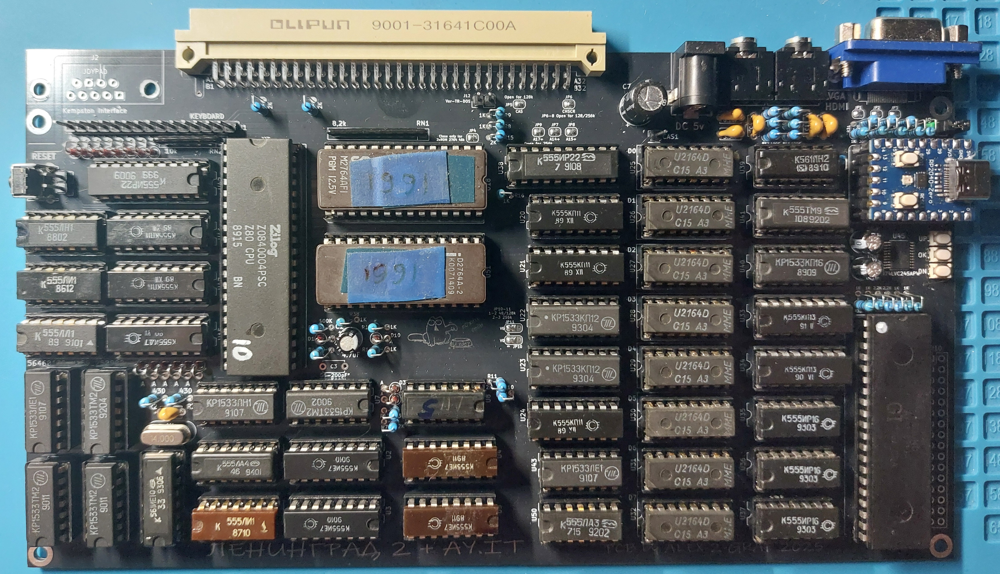
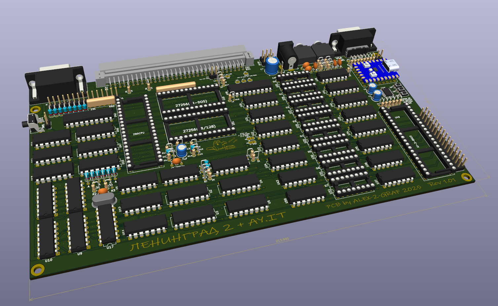
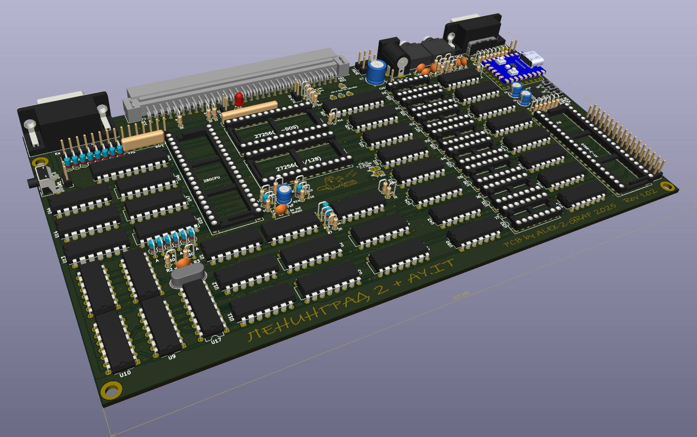
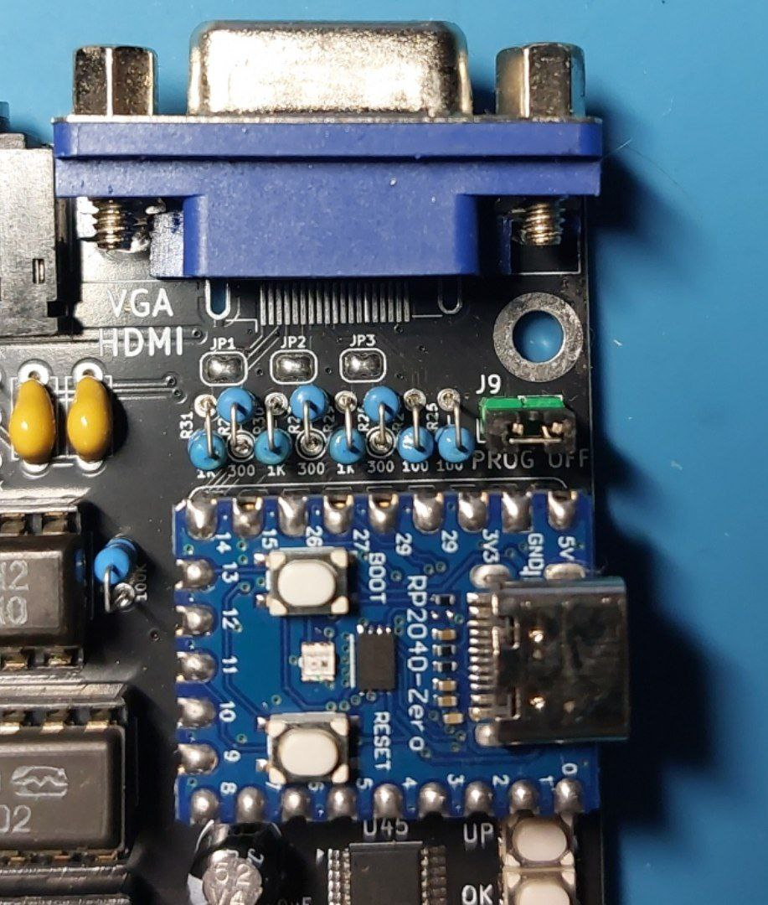
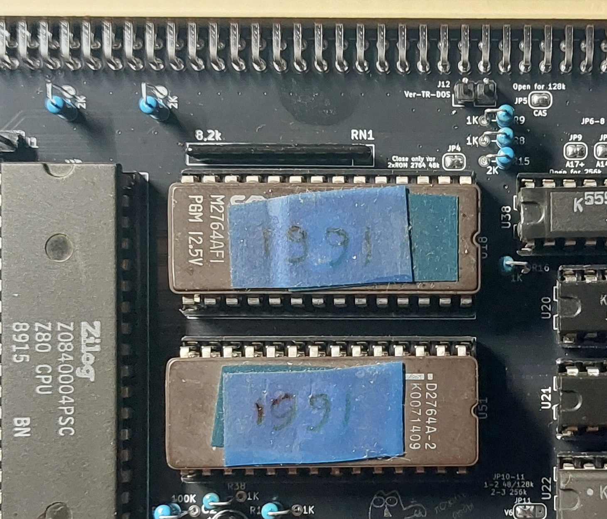
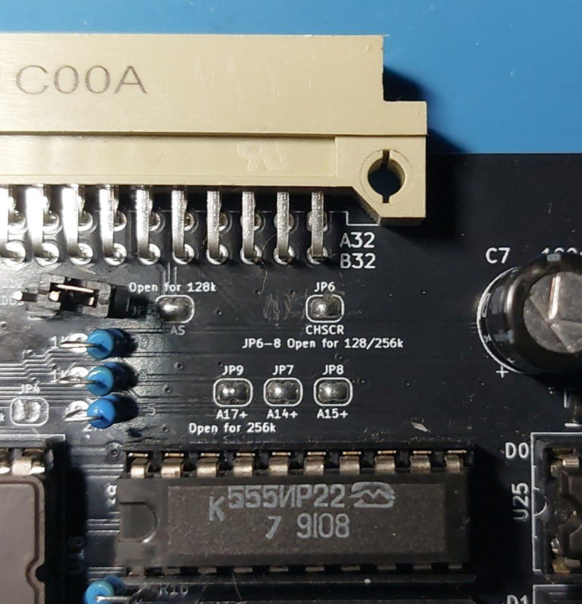
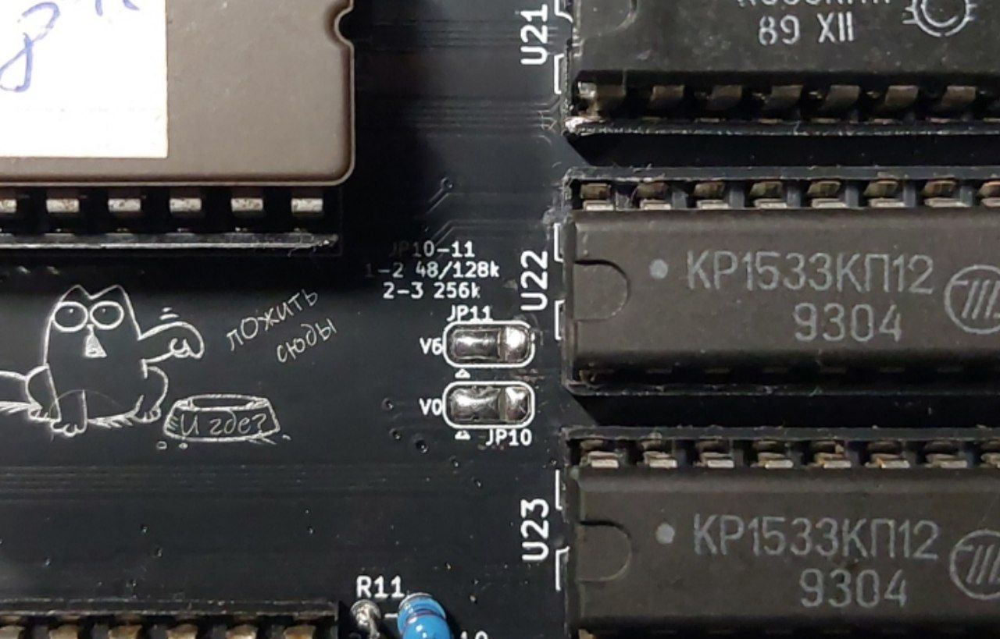
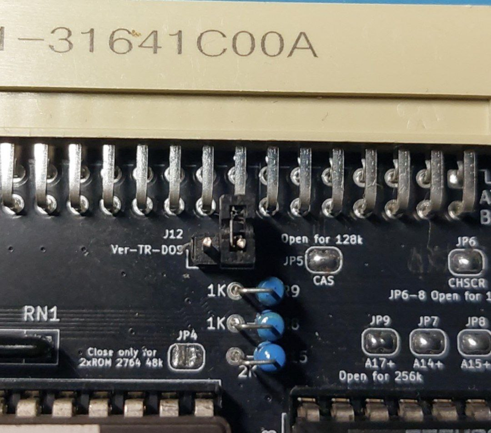
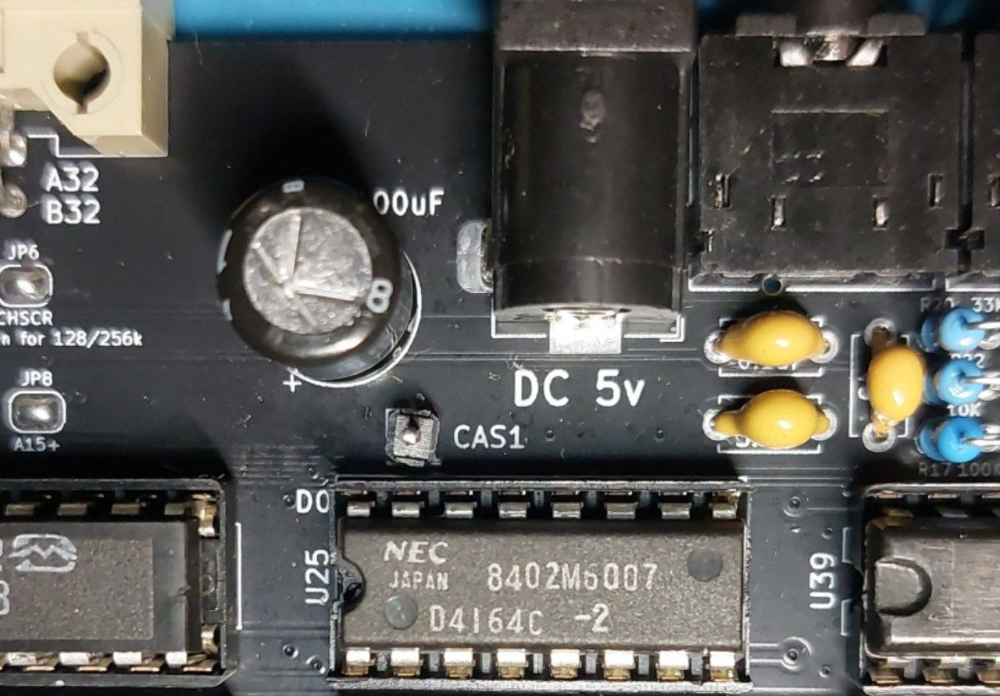

# LENINGRAD-2-48k
## Leningrad-2. Russian ZX Spectrum clone. Schematics and PCB.

«Ленинград-2» — это бытовой персональный компьютер, совместимый с ZX Spectrum,  
созданный в 1989 году как дальнейшее развитие популярной модели «Ленинград».  
Это усовершенствованная версия легендарной первой модели, которая отличалась простотой схемы.  
«Ленинград-2» сохранил эту простоту схемотехники, лёгкость сборки и настройки.  
Компьютер построен на базе процессора Z80. Имеет 48 Кб оперативной памяти,  
реализованной на микросхемах типа РУ5.  
«Ленинград-2» (наряду с первой версией) стал одним из самых массовых клонов ZX Spectrum  
в бывшем СССР благодаря возможности собрать его самостоятельно из доступных радиодеталей.

Преимуществом «Ленинграда-2» по сравнению с другими клонами того времени  
было наличие разъёма для расширения.  
И после «Радио 86РК» и одесского клона (к большому сожалению, схемы не сохранились)  
было принято решение собрать «Ленинград-2».  
А буквально через месяц — и расширить его до 128K, и прикрутить БДИ.  
Правда, летом 1990 года пришлось поехать в стройотряд и заработать на два дисковода 5,25.  
И этот компьютер проработал верой и правдой всё время учёбы в университете.  
Каких только расчётов он не видел.  
И где только не побывал. Даже на ЧАЭС.  
Он в рабочем состоянии до сих пор.  

Прадедушка  

  

В скором времени он поселится в новом корпусе.  
Ну а в 2025 году я решил переразвести его под новые реалии.  
Ну и сразу заложить возможность расширения,  
чтобы потом не резать и не МГТФить.  
В результате на свет появился «Ленинград 2 2025».  
  

Основные отличия заключались в расположении на плате конвертера  
от AlexEkb [ZX_RGBI2VGA-HDMI](https://github.com/AlexEkb4ever/ZX_RGBI2VGA-HDMI) и музыкального процессора AY-3-8910,  
а также в мелких доработках, связанных с дальнейшими расширениями.  
Заодно родилась идея сделать переходник на Немо-bus и ZX-bus [Gerber](Gerber/Back_L2_Nemo_Spec_Gerber.zip).  

  

Что позволило подключать различные платы расширения.  
Например, Космо Карту от Игоря [ZXKM](https://github.com/Igor-azx987sa/ZXKM).  
   
Результат оправдал ожидания.  
  
  

После обкатки и незначительных косметических доработок была выпущена ревизия [1.01](Export/Leningrad%202%2048k%202025%201.01.html) [Схема](Export/Leningrad%202%2048k%202025%201.01.pdf) [Gerber](Gerber/Leningrad%202%2048k%202025%201.01%20GERBER.zip)  
  
  

Ошибок выявлено не было, но были учтены некоторые пожелания.  
И свет увидела новая ревизия [1.02](Export/Leningrad%202%2048k%202025%201.02.html) [Схема](Export/Leningrad%202%2048k%202025%201.02.pdf) [Gerber](Gerber/Leningrad%202%2048k%202025%201.02%20GERBER.zip)  

  
  
## Сборка
  
Как правило, сборка и наладка проблем не вызывают.  
Хотя всё же проясним назначение перемычек.  
  
JP1, JP2 и JP3 замыкаются в случае установки VGA-разъёма.  
При установке HDMI их замыкать не надо.  
Но при этом все резисторы R24-31 заменяются на 270 Ом.  
Джампер J9 необходим для снятия питания с RP2040-Zero при перепрошивке.  
  
  
  
JP4 замыкается в случае установки двух ПЗУ 2764.  

  
  
Перемычки JP5-JP9 запаиваются все.  
Они нужны для будущих расширений памяти.  
  
  
  
Перемычки JP10 и JP11 запаиваются с левой стороны.  
Они перепаиваются только для расширения до 256K на 41256 (РУ7).  
  
  
  
Джампер J12 необходим для выбора прошивки БДИ  
в случае установки 27256 с двумя версиями TR-DOS.  
  
  
  
Пин CAS1 необходим для расширения до 128K двумя линейками 4164 (РУ5).  
  
  
  
## ПЗУ  
  
Выбор ПЗУ описан [тут](ROM).  

## Рекомендуемые аксессуары

* [BDI-TR-DOS](https://github.com/Alex-2-Graf/Leningrad2-BDI-TR-DOS)
* [DivMMC](https://github.com/Alex-2-Graf/Leningrad2-DivMMC)
* [Memory Expansions and AY/TS](https://github.com/Alex-2-Graf/Leningrad2-Upgrade-Kit)
   
## Авторы и благодарности  
  
Alex Ekb — за RGB2VGA-конвертер.  
Сообществу [Scorpion ZS & Ленинград](https://t.me/zs_scorpion) и моим друзьям.
