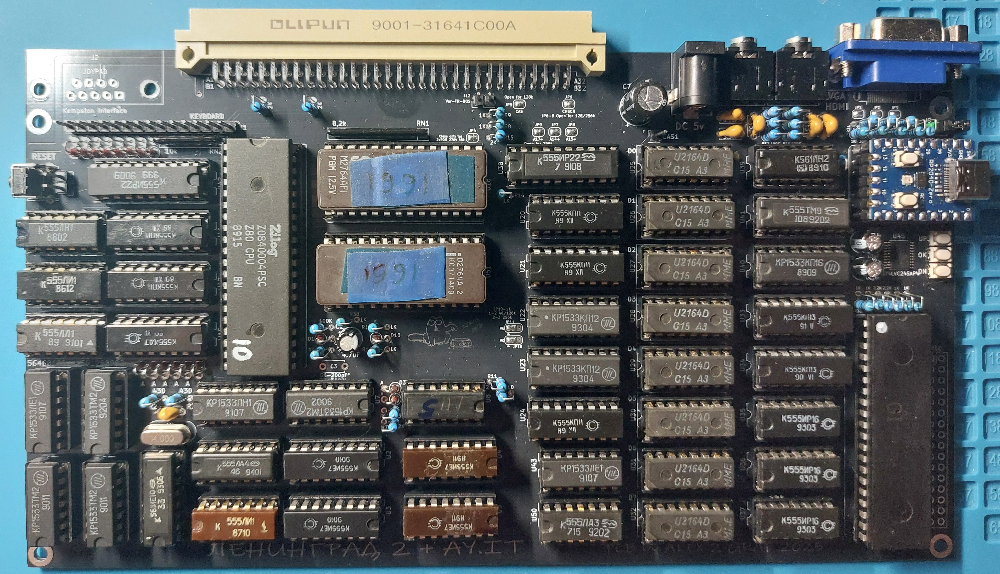

# LENINGRAD-2-48k

## Leningrad-2. Russian ZX Spectrum clone. Schematics and PCB.

> [English](README.md) | [Русский](README.ru.md)

"Leningrad-2" is a home personal computer compatible with the ZX Spectrum, created in 1989 as an evolution of the popular "Leningrad" model. It is an improved version of the legendary first model, which was highly regarded for its simple circuitry. 

"Leningrad-2" retained this elegant and simple design, making it easy to assemble and tune. The computer is powered by a Z80 processor and features 48 KB of RAM implemented on Soviet KR565RU5 (КР565РУ5) chips.

Along with its predecessor, "Leningrad-2" became one of the most widespread ZX Spectrum clones in the former USSR, as hobbyists could easily build it at home using widely available radio components. A key advantage of "Leningrad-2" over other contemporary clones was its dedicated expansion slot.

***

### Project History

After building a "Radio 86RK" and an Odessa-designed clone (sadly, the schematics for the latter are lost), I decided to assemble the "Leningrad-2". Just a month later, I expanded it to 128K and added a Beta Disk Interface (BDI). 

To afford two 5.25-inch floppy drives, I spent the summer of 1990 working with a student construction brigade. This computer served me faithfully throughout my entire university years. It handled countless complex calculations, traveled to many places — including the Chernobyl Nuclear Power Plant (ChNPP) — and remains fully functional to this day.
  
  
  
The original "great-grandfather" board will soon be housed in a brand-new case.

### Leningrad-2 2025 Revision

In 2025, I decided to redesign the PCB to match modern realities. I wanted to build in expansion capabilities right from the start, avoiding any future track-cutting or messy wire-wrap modifications (MGTF wire). 
  
  
  

As a result, the **"Leningrad 2 2025"** was born. The main upgrades include onboard integration of:
*   The **ZX_RGBI2VGA-HDMI** converter by AlexEkb.
*   The **AY-3-8910** sound chip.
*   Minor improvements for future expansions.

Alongside this, I designed a Gerber adapter for Nemo-bus and ZX-bus. This allows the connection of various expansion cards, such as the Cosmo Card by Igor ZXKM.  
  
  
  
  
  
The results completely met expectations. Following real-world testing and minor cosmetic tweaks, I released a few revisions:

*   **Revision 1.01** ([Schematics](Export/Leningrad%202%2048k%202025%201.01.pdf) / [Gerber](Gerber/Leningrad%202%2048k%202025%201.01%20GERBER.zip)) — *Initial release. No bugs found, but updated based on community feedback.*
*   **Revision 1.02** ([Schematics](Export/Leningrad%202%2048k%202025%201.02.pdf) / [Gerber](Gerber/Leningrad%202%2048k%202025%201.02%20GERBER.zip)) — *The latest current revision.*

---

## Assembly & Jumper Settings

Generally, assembly and tuning are straightforward. Here is the configuration guide for the onboard jumpers:

*   **JP1, JP2, JP3**: Short these if you are installing a VGA connector. Leave them open for HDMI. If using HDMI, make sure all resistors `R24-31` are replaced with 270 Ohm.
*   **J9**: Used to disconnect power from the RP2040-Zero board during firmware flashing.
*   **JP4**: Short this if you are installing two 2764 ROMs.
*   **JP5–JP9**: Solder all of these. They are required for future memory expansions.
*   **JP10, JP11**: Solder on the left side. You only need to resolder them if you expand the RAM to 256K using 41256 (РУ7) chips.
*   **J12**: Used to select the BDI firmware if you install a 27256 ROM containing two versions of TR-DOS.
*   **CAS1 Pin**: Required for expanding the memory to 128K using two rows of 4164 (РУ5) chips.

---

## ROM & Video Configuration

*   **ROM**: Detailed ROM selection guide can be found [here](ROM).
*   **VGA**: RGB2VGA converter setup instructions are available [here](VGA).

---

## Recommended Accessories

* [BDI-TR-DOS](https://github.com/Alex-2-Graf/Leningrad2-BDI-TR-DOS)
* [DivMMC](https://github.com/Alex-2-Graf/Leningrad2-DivMMC)
* [Memory Expansions and AY/TS](https://github.com/Alex-2-Graf/Leningrad2-Upgrade-Kit)
* [LGT-Turbo-Sound-emulator](https://github.com/Alex-2-Graf/LGT-Turbo-Sound-emulator)
* [ZX-EQ Nemo-bus Edition](https://github.com/Alex-2-Graf/ZX-EQ)

---

## Credits & Acknowledgments

*   **Alex Ekb** — for the amazing RGB2VGA converter design.
*   The **Scorpion ZS & Leningrad** community, and all my friends who supported this project.
